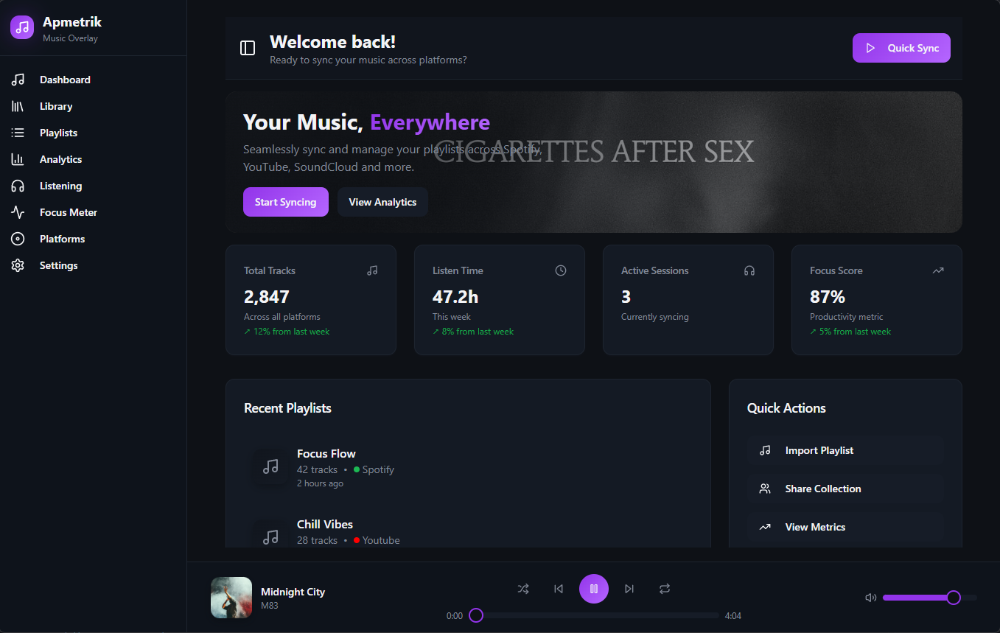
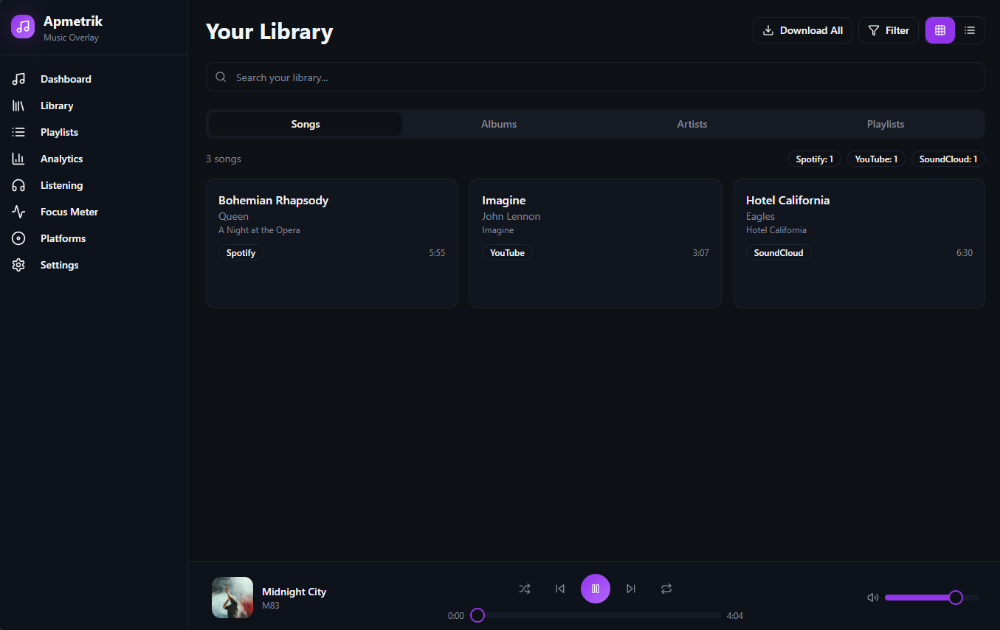
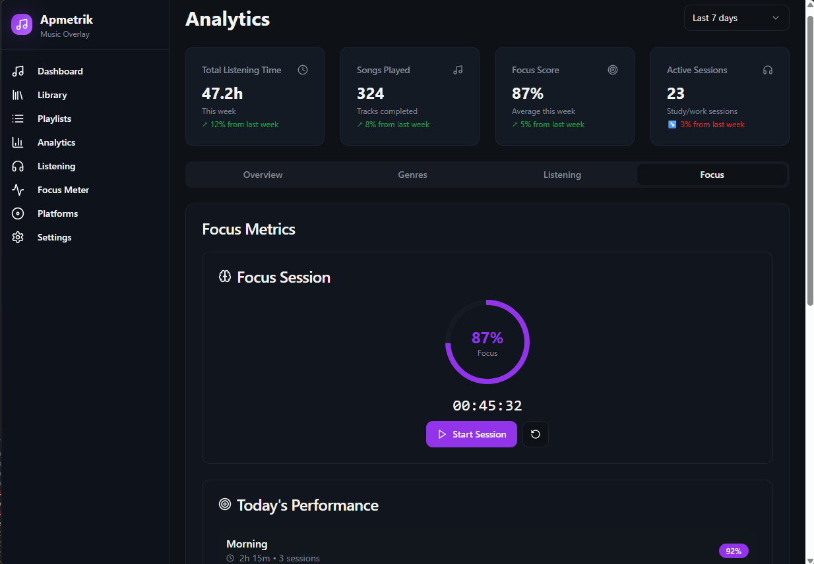

# ApMetrik

A cross-platform music management and analytics desktop application built with Electron and React. ApMetrik allows you to sync your music library across multiple streaming platforms, analyze your listening habits, and manage your playlists all in one place.

## Features

- 🎵 **Multi-Platform Music Sync** - Connect and sync your music across Spotify, YouTube Music, SoundCloud, and Apple Music
- 📊 **Music Analytics** - Track your listening habits, favorite artists, and music trends
- 🎶 **Music Player** - Built-in player with playlist management
- 📚 **Library Management** - Organize and browse your music collection
- 🎨 **Modern UI** - Beautiful, responsive interface built with React and Tailwind CSS
- 🔄 **Overlay Mode** - Quick access overlay window that stays on top
- ⌨️ **Keyboard Shortcuts** - Fast window toggling with `Ctrl+Shift+A` (or `Cmd+Shift+A` on Mac)

### Landing Page


### Library


### Analytics


### Sessions


## Tech Stack

- **Frontend**: React 19, TypeScript, Vite
- **Desktop**: Electron
- **UI Components**: Radix UI, Tailwind CSS
- **State Management**: TanStack Query (React Query)
- **Routing**: React Router DOM

## Prerequisites

- Node.js (v16 or higher recommended)
- npm (comes with Node.js)

## Installation

1. **Clone the repository** (if you haven't already):
   ```bash
   git clone <repository-url>
   cd ApMetrik
   ```

2. **Install root dependencies**:
   ```bash
   npm install
   ```

3. **Install React app dependencies**:
   ```bash
   cd apmetrik-main
   npm install
   cd ..
   ```

## Running the Application

### Development Mode

To start the application in development mode:

```bash
npm start
```

This command will:
- Start the Vite dev server for the React app (runs on `http://localhost:5173`)
- Launch the Electron application
- Enable hot module replacement (HMR) for fast development

### Individual Commands

You can also run the components separately:

**Start only the React dev server:**
```bash
cd apmetrik-main
npm run dev
```

**Start only Electron:**
```bash
npm run electron
```

## Application Windows

ApMetrik creates two windows when launched:

1. **Overlay Window** - A small, always-on-top window (600x36px) that appears in the top-left corner
2. **Main App Window** - The full application interface (1360x860px) that starts hidden

### Window Controls

- **Toggle Windows**: Press `Ctrl+Shift+A` (Windows/Linux) or `Cmd+Shift+A` (Mac) to switch between the overlay and main window
- **Close Main Window**: Clicking the close button hides the main window and shows the overlay (the app stays running)

## Project Structure

```
ApMetrik/
├── apmetrik-main/          # React frontend application
│   ├── src/
│   │   ├── components/     # React components
│   │   ├── pages/          # Page components (Index, Library, Playlists, Analytics, Settings)
│   │   ├── contexts/       # React contexts
│   │   └── App.tsx         # Main React app
│   ├── package.json        # Frontend dependencies
│   └── vite.config.ts      # Vite configuration
├── main.js                 # Electron main process
├── preload.js              # Electron preload script
├── public/                 # Static assets and HTML files
├── styles/                 # Global styles
├── package.json            # Root dependencies and scripts
└── README.md               # This file
```

## Available Pages

- **Dashboard** (`/`) - Overview with quick stats and recent activity
- **Library** (`/library`) - Browse your music collection
- **Playlists** (`/playlists`) - Manage your playlists
- **Analytics** (`/analytics`, `/listening`, `/focus`) - View listening statistics and insights
- **Settings** (`/settings`, `/platforms`) - Configure platform connections and app settings

## Building for Production

To build the application for production:

1. **Build the React app**:
   ```bash
   cd apmetrik-main
   npm run build
   cd ..
   ```

2. **Package with Electron**:
   Use an Electron builder tool like `electron-builder` or `electron-forge` to create distributables.

## Development Notes

- The app uses Vite's dev server in development mode (`http://localhost:5173`)
- In production, Electron loads the built files from `dist/`
- The overlay window loads from `public/overlay.html`
- Context isolation is enabled for security
- Node integration is disabled in renderer processes

## Troubleshooting

**App won't start:**
- Ensure all dependencies are installed in both root and `apmetrik-main` directories
- Check that Node.js version is compatible (v16+)

**React dev server not connecting:**
- Verify the Vite dev server is running on port 5173
- Check for port conflicts

**Electron window not appearing:**
- Check the console for errors
- Ensure `main.js` is correctly configured

## License

ISC

## Contributing

Contributions are welcome! Please feel free to submit a Pull Request.

---

**Note**: This application requires API credentials for the music platforms you want to connect. Make sure to configure these in the Settings page after launching the app.

